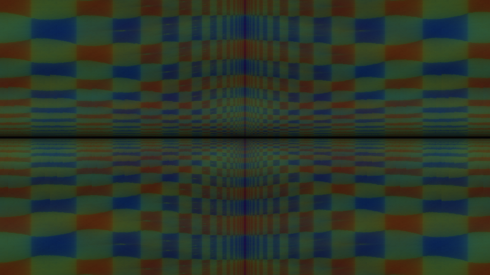
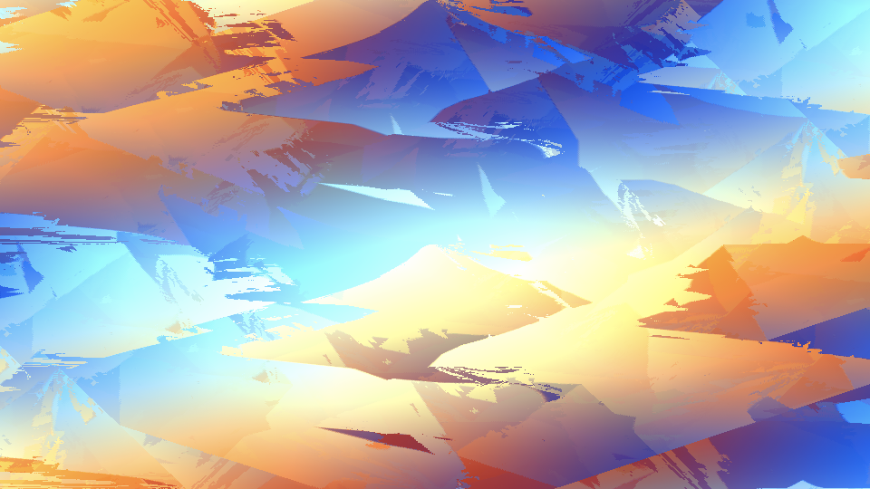
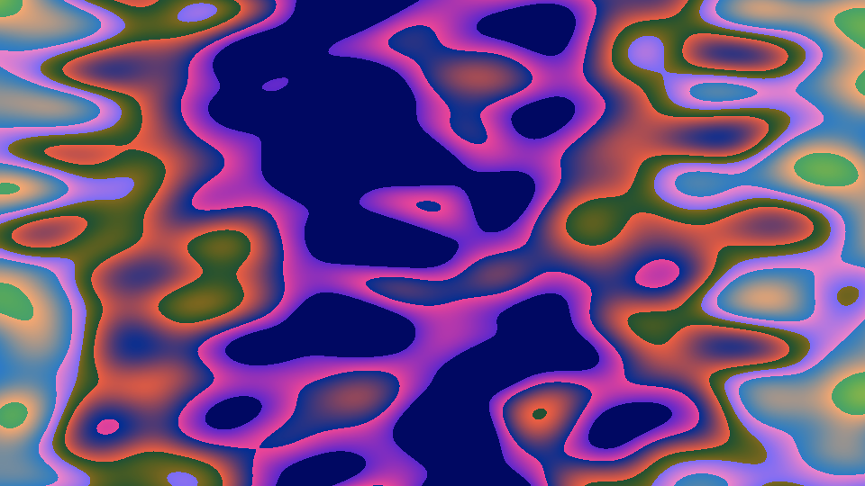
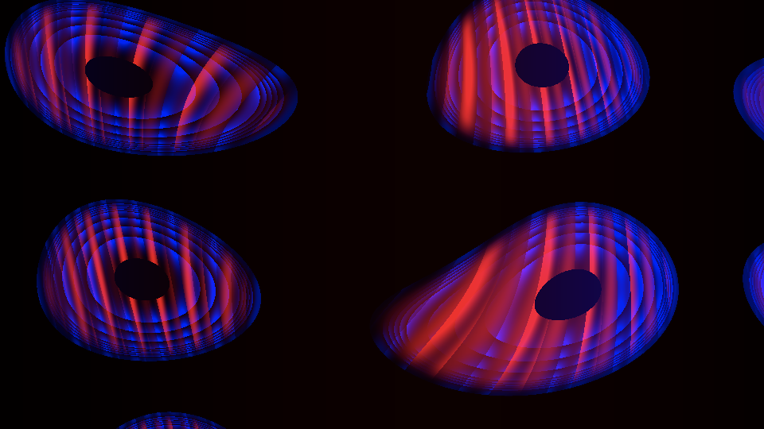
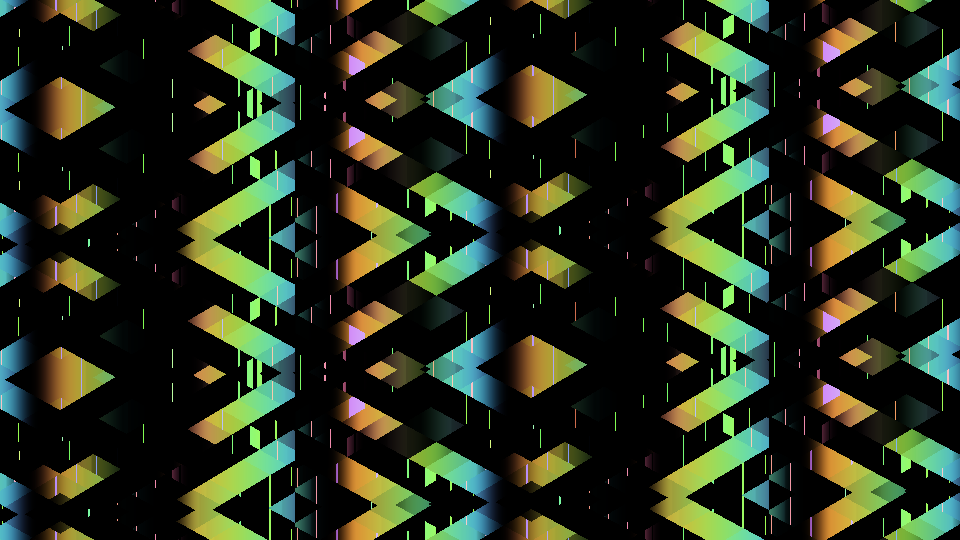
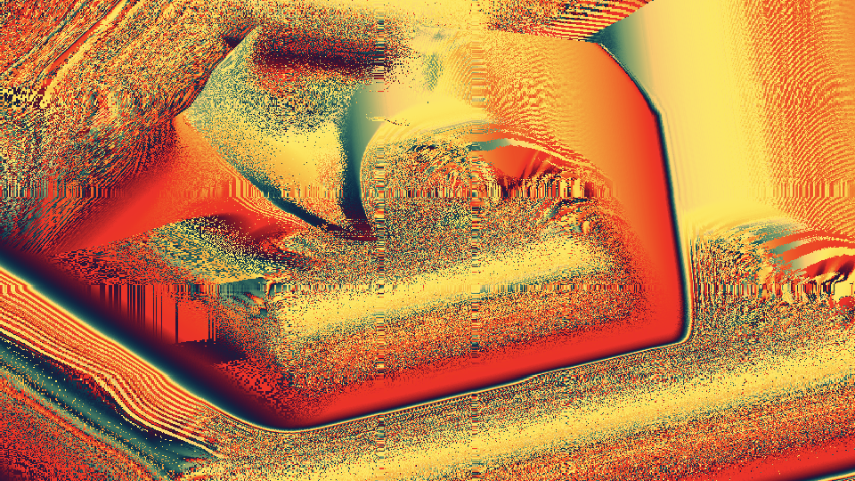
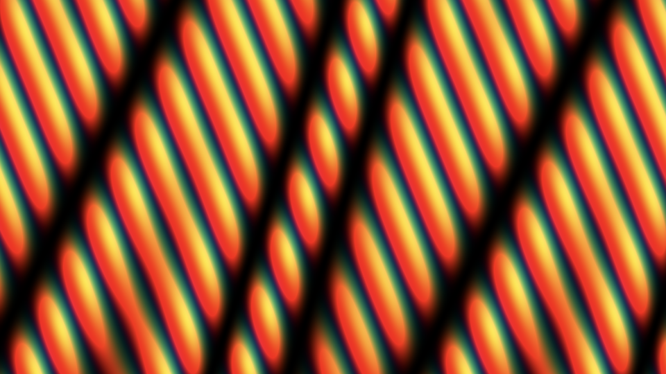
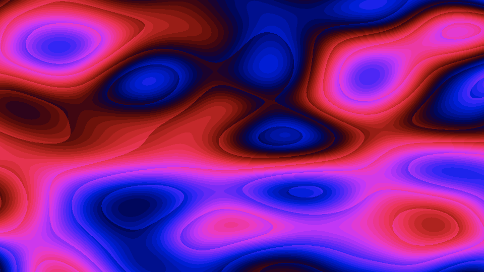
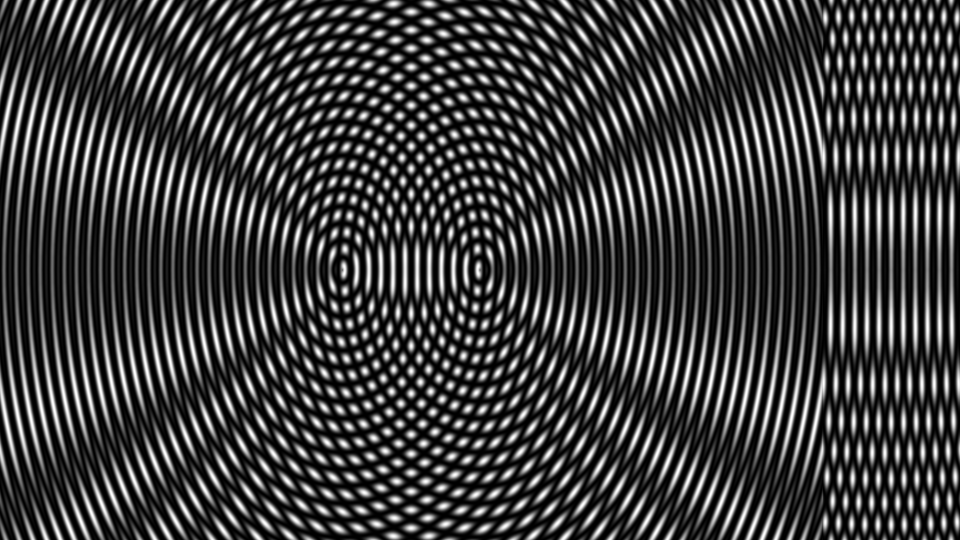
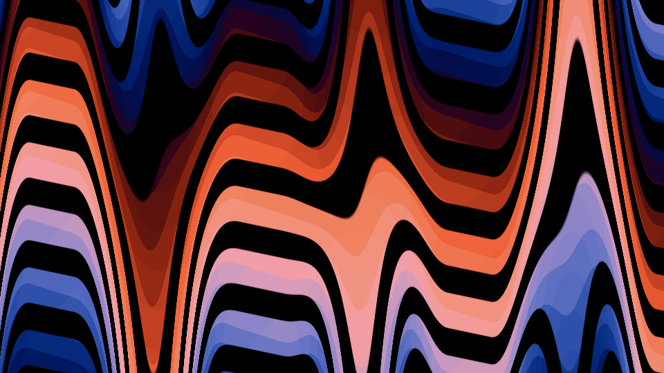

### MSL-Hydra-Synth

Export [ojack](https://github.com/ojack) / [hydra-synth](https://github.com/ojack/hydra-synth) as Metal shader (WIP).

### Note

* Source buffer is not supported.
* Number of output buffers available is currently one.

### Build
	
	$node example_11.js 

The following two files are export.

* ./assets/u0.json
* ./assets/o0.metal

### Build MSL

	$ cd ./assets
	$ xcrun -sdk macosx metal -c o0.metal -o o0.air; xcrun -sdk macosx metallib o0.air -o o0.metallib

### Play

[Hydra-Synth-Player](https://github.com/mizt/MSL-Hydra-Synth-Player)

### Test

[example\_3](https://hydra-editor-v1.glitch.me/?sketch_id=example_3&code=JTJGJTJGJTIwYnklMjBPbGl2aWElMjBKYWNrJTBBJTBBb3NjKDIwJTJDJTIwMC4wMyUyQyUyMDEuNykua2FsZWlkKCkubXVsdChvc2MoMjAlMkMlMjAwLjAwMSUyQyUyMDApLnJvdGF0ZSgxLjU4KSkuYmxlbmQobzAlMkMlMjAwLjk0KS5tb2R1bGF0ZVNjYWxlKG9zYygxMCUyQyUyMDApJTJDLTAuMDMpLnNjYWxlKDAuOCUyQyUyMCgpJTIwJTNEJTNFJTIwKDEuMDUlMjAlMkIlMjAwLjElMjAqJTIwTWF0aC5zaW4oMC4wNSp0aW1lKSkpLm91dChvMCk=)

by Olivia Jack

	osc(20, 0.03, 1.7).kaleid().mult(osc(20, 0.001, 0).rotate(1.58)).blend(o0, 0.94).modulateScale(osc(10, 0),-0.03).scale(0.8, () => (1.05 + 0.1 * Math.sin(0.05*time))).out(o0)

[example\_4](https://hydra-editor-v1.glitch.me/?sketch_id=example_4&code=JTJGJTJGJTIwYnklMjBOZWxzb24lMjBWZXJhJTBBJTJGJTJGJTIwdHdpdHRlciUzQSUyMCU0MG5lbF9zb25vbG9naWElMEElMEFvc2MoOCUyQy0wLjUlMkMlMjAxKS5jb2xvcigtMS41JTJDJTIwLTEuNSUyQyUyMC0xLjUpLmJsZW5kKG8wKS5yb3RhdGUoLTAuNSUyQyUyMC0wLjUpLm1vZHVsYXRlKHNoYXBlKDQpLnJvdGF0ZSgwLjUlMkMlMjAwLjUpLnNjYWxlKDIpLnJlcGVhdFgoMiUyQyUyMDIpLm1vZHVsYXRlKG8wJTJDJTIwKCklMjAlM0QlM0UlMjBtb3VzZS54JTIwKiUyMDAuMDAwNSkucmVwZWF0WSgyJTJDJTIwMikpLm91dChvMCklMEElMEElMEElMEElMEElMEE=)

by Nelson Vera   
twitter: @nel\_sonologia

	osc(8,-0.5, 1).color(-1.5, -1.5, -1.5).blend(o0).rotate(-0.5, -0.5).modulate(shape(4).rotate(0.5, 0.5).scale(2).repeatX(2, 2).modulate(o0, () => mouse.x * 0.0005).repeatY(2, 2)).out(o0)

[example\_6](https://hydra-editor-v1.glitch.me/?sketch_id=example_6&code=JTJGJTJGJTIwYnklMjBEJUMzJUE5Ym9yYSUyMEZhbGxlaXJvcyUyMEdvbnphbGVzJTBBJTJGJTJGJTIwaHR0cHMlM0ElMkYlMkZ3d3cuZ29uemFsZXNkZWJvcmEuY29tJTJGJTBBJTBBb3NjKDUpLmFkZChub2lzZSg1JTJDJTIwMikpLmNvbG9yKDAlMkMlMjAwJTJDJTIwMykuY29sb3JhbWEoMC40KS5vdXQoKSUwQSUwQSUwQSUwQQ==)

by Débora Falleiros Gonzales   
https://www.gonzalesdebora.com/

	osc(5).add(noise(5, 2)).color(0, 0, 3).colorama(0.4).out()

[example\_10](https://hydra-editor-v1.glitch.me/?sketch_id=example_10&code=JTJGJTJGJTIwYnklMjBaYWNoJTIwS3JhbGwlMEElMkYlMkYlMjBodHRwJTNBJTJGJTJGemFjaGtyYWxsLm9ubGluZSUyRiUwQSUwQW9zYyglMjAyMTUlMkMlMjAwLjElMkMlMjAyJTIwKSUwQS5tb2R1bGF0ZSglMEElMjAlMjBvc2MoJTIwMiUyQyUyMC0wLjMlMkMlMjAxMDAlMjApJTBBJTIwJTIwLnJvdGF0ZSgxNSklMEEpJTBBLm11bHQoJTBBJTIwJTIwb3NjKCUyMDIxNSUyQyUyMC0wLjElMkMlMjAyKSUwQSUyMCUyMC5waXhlbGF0ZSglMjA1MCUyQyUyMDUwJTIwKSUwQSklMEEuY29sb3IoJTIwMC45JTJDJTIwMC4wJTJDJTIwMC45JTIwKSUwQS5tb2R1bGF0ZSglMEElMjAlMjBvc2MoJTIwNiUyQyUyMC0wLjElMjApJTBBJTIwJTIwLnJvdGF0ZSglMjA5JTIwKSUwQSklMEEuYWRkKCUwQSUyMCUyMG9zYyglMjAxMCUyQyUyMC0wLjklMkMlMjA5MDAlMjApJTBBJTIwJTIwLmNvbG9yKDElMkMwJTJDMSklMEEpJTBBLm11bHQoJTBBJTIwJTIwc2hhcGUoOTAwJTJDJTIwMC4yJTJDJTIwMSklMEElMjAlMjAubHVtYSgpJTBBJTIwJTIwLnJlcGVhdFgoMiklMEElMjAlMjAucmVwZWF0WSgyKSUwQSUyMCUyMC5jb2xvcmFtYSgxMCklMEEpJTBBLm1vZHVsYXRlKCUwQSUyMCUyMG9zYyglMjA5JTJDJTIwLTAuMyUyQyUyMDkwMCUyMCklMEElMjAlMjAucm90YXRlKCUyMDYlMjApJTBBKSUwQS5hZGQoJTBBJTIwJTIwb3NjKDQlMkMlMjAxJTJDJTIwOTApJTBBJTIwJTIwLmNvbG9yKDAuMiUyQzAlMkMxKSUwQSklMEEub3V0KCklMEE=)

by Zach Krall   
http://zachkrall.online/

	osc( 215, 0.1, 2 )
	.modulate(
	  osc( 2, -0.3, 100 )
	  .rotate(15)
	)
	.mult(
	  osc( 215, -0.1, 2)
	  .pixelate( 50, 50 )
	)
	.color( 0.9, 0.0, 0.9 )
	.modulate(
	  osc( 6, -0.1 )
	  .rotate( 9 )
	)
	.add(
	  osc( 10, -0.9, 900 )
	  .color(1,0,1)
	)
	.mult(
	  shape(900, 0.2, 1)
	  .luma()
	  .repeatX(2)
	  .repeatY(2)
	  .colorama(10)
	)
	.modulate(
	  osc( 9, -0.3, 900 )
	  .rotate( 6 )
	)
	.add(
	  osc(4, 1, 90)
	  .color(0.2,0,1)
	)
	.out()

[example\_11](https://hydra-editor-v1.glitch.me/?sketch_id=example_11&code=JTJGJTJGJTIwYnklMjBaYWNoJTIwS3JhbGwlMEElMkYlMkYlMjBodHRwJTNBJTJGJTJGemFjaGtyYWxsLm9ubGluZSUyRiUwQSUwQW9zYygxMCUyQyUyMDAuOSUyQyUyMDMwMCklMEEuY29sb3IoMC45JTJDJTIwMC43JTJDJTIwMC44KSUwQS5kaWZmKCUwQSUyMCUyMG9zYyg0NSUyQyUyMDAuMyUyQyUyMDEwMCklMEElMjAlMjAuY29sb3IoMC45JTJDJTIwMC45JTJDJTIwMC45KSUwQSUyMCUyMC5yb3RhdGUoMC4xOCklMEElMjAlMjAucGl4ZWxhdGUoMTIpJTBBJTIwJTIwLmthbGVpZCgpJTBBKSUwQS5zY3JvbGxYKDEwKSUwQS5jb2xvcmFtYSgpJTBBLmx1bWEoKSUwQS5yZXBlYXRYKDQpJTBBLnJlcGVhdFkoNCklMEEubW9kdWxhdGUoJTBBJTIwJTIwb3NjKDElMkMlMjAtMC45JTJDJTIwMzAwKSUwQSklMEEuc2NhbGUoMiklMEEub3V0KCklMEE=)

by Zach Krall
http://zachkrall.online/

	osc(10, 0.9, 300)
	.color(0.9, 0.7, 0.8)
	.diff(
	  osc(45, 0.3, 100)
	  .color(0.9, 0.9, 0.9)
	  .rotate(0.18)
	  .pixelate(12)
	  .kaleid()
	)
	.scrollX(10)
	.colorama()
	.luma()
	.repeatX(4)
	.repeatY(4)
	.modulate(
	  osc(1, -0.9, 300)
	)
	.scale(2)
	.out()

[example\_14](https://hydra-editor-v1.glitch.me/?sketch_id=example_14&code=JTJGJTJGJTIwYnklMjBPbGl2aWElMjBKYWNrJTBBJTJGJTJGJTIwJTQwX29qYWNrXyUwQSUwQW9zYygyMCUyQyUyMDAuMDElMkMlMjAxLjEpJTBBJTA5LmthbGVpZCg1KSUwQSUwOS5jb2xvcigyLjgzJTJDMC45MSUyQzAuMzkpJTBBJTA5LnJvdGF0ZSgwJTJDJTIwMC4xKSUwQSUwOS5tb2R1bGF0ZShvMCUyQyUyMCgpJTIwJTNEJTNFJTIwbW91c2UueCUyMColMjAwLjAwMDMpJTBBJTA5LnNjYWxlKDEuMDEpJTBBJTIwJTIwJTA5Lm91dChvMCk=)

by Olivia Jack   
@\_ojack\_

	osc(20, 0.01, 1.1)
		.kaleid(5)
		.color(2.83,0.91,0.39)
		.rotate(0, 0.1)
		.modulate(o0, () => mouse.x * 0.0003)
		.scale(1.01)
	  	.out(o0)

[example\_15](https://hydra-editor-v1.glitch.me/?sketch_id=example_15&code=JTJGJTJGJTIwYnklMjBPbGl2aWElMjBKYWNrJTBBJTJGJTJGJTIwaHR0cHMlM0ElMkYlMkZvamFjay5naXRodWIuaW8lMEElMEFvc2MoMTAwJTJDJTIwMC4wMSUyQyUyMDEuNCklMEElMDkucm90YXRlKDAlMkMlMjAwLjEpJTBBJTA5Lm11bHQob3NjKDEwJTJDJTIwMC4xKS5tb2R1bGF0ZShvc2MoMTApLnJvdGF0ZSgwJTJDJTIwLTAuMSklMkMlMjAxKSklMEElMDkuY29sb3IoMi44MyUyQzAuOTElMkMwLjM5KSUwQSUyMCUyMC5vdXQobzAp)

by Olivia Jack   
https://ojack.github.io

	osc(100, 0.01, 1.4)
	.rotate(0, 0.1)
	.mult(osc(10, 0.1).modulate(osc(10).rotate(0, -0.1), 1))
	.color(2.83,0.91,0.39)
	.out(o0)

[example\_16](https://hydra-editor-v1.glitch.me/?sketch_id=example_16&code=JTJGJTJGJTIwYnklMjBPbGl2aWElMjBKYWNrJTBBJTJGJTJGJTIwaHR0cHMlM0ElMkYlMkZvamFjay5naXRodWIuaW8lMEElMEFvc2MoNCUyQyUyMDAuMSUyQyUyMDAuOCkuY29sb3IoMS4wNCUyQzAlMkMlMjAtMS4xKS5yb3RhdGUoMC4zMCUyQyUyMDAuMSkucGl4ZWxhdGUoMiUyQyUyMDIwKS5tb2R1bGF0ZShub2lzZSgyLjUpJTJDJTIwKCklMjAlM0QlM0UlMjAxLjUlMjAqJTIwTWF0aC5zaW4oMC4wOCUyMColMjB0aW1lKSkub3V0KG8wKQ==)

by Olivia Jack   
https://ojack.github.io

	osc(4, 0.1, 0.8).color(1.04,0, -1.1).rotate(0.30, 0.1).pixelate(2, 20).modulate(noise(2.5), () => 1.5 * Math.sin(0.08 * time)).out(o0)
	
[example\_17](https://hydra-editor-v1.glitch.me/?sketch_id=example_17&code=JTJGJTJGJTIwbW9pcmUlMEElMkYlMkYlMjBieSUyME9saXZpYSUyMEphY2slMEElMkYlMkYlMjB0d2l0dGVyJTNBJTIwJTQwX29qYWNrXyUwQSUwQXBhdHRlcm4lMjAlM0QlMjAoKSUyMCUzRCUzRSUyMG9zYygyMDAlMkMlMjAwKS5rYWxlaWQoMjAwKS5zY2FsZSgxJTJDJTIwMC40KSUwQSUyRiUyRiUwQXBhdHRlcm4oKSUwQSUyMCUyMC5zY3JvbGxYKDAuMSUyQyUyMDAuMDEpJTBBJTIwJTIwLm11bHQocGF0dGVybigpKSUwQSUyMCUyMC5vdXQoKQ==)

by Olivia Jack
twitter: @_ojack_

	pattern = () => osc(200, 0).kaleid(200).scale(1, 0.4)
	//
	pattern()
	  .scrollX(0.1, 0.01)
	  .mult(pattern())
	  .out()
	  
	  
[example\_18](https://hydra-editor-v1.glitch.me/?sketch_id=example_18&code=JTJGJTJGJTIwYnklMjBPbGl2aWElMjBKYWNrJTBBJTJGJTJGJTIwaHR0cHMlM0ElMkYlMkZvamFjay5naXRodWIuaW8lMEElMEFvc2MoNiUyQyUyMDAlMkMlMjAwLjgpJTBBJTIwJTIwLmNvbG9yKDEuMTQlMkMlMjAwLjYlMkMuODApJTBBJTIwJTIwLnJvdGF0ZSgwLjkyJTJDJTIwMC4zKSUwQSUyMCUyMC5waXhlbGF0ZSgyMCUyQyUyMDEwKSUwQSUyMCUyMC5tdWx0KG9zYyg0MCUyQyUyMDAuMDMpLnRocmVzaCgwLjQpLnJvdGF0ZSgwJTJDJTIwLTAuMDIpKSUwQSUyMCUyMC5tb2R1bGF0ZVJvdGF0ZShvc2MoMjAlMkMlMjAwKS50aHJlc2goMC4zJTJDJTIwMC42KSUyQyUyMCgpJTIwJTNEJTNFJTIwMC4xJTIwJTJCJTIwbW91c2UueCUyMColMjAwLjAwMiklMEElMjAlMjAub3V0KG8wKQ==)

by Olivia Jack   
https://ojack.github.io

	osc(6, 0, 0.8)
	  .color(1.14, 0.6,.80)
	  .rotate(0.92, 0.3)
	  .pixelate(20, 10)
	  .mult(osc(40, 0.03).thresh(0.4).rotate(0, -0.02))
	  .modulateRotate(osc(20, 0).thresh(0.3, 0.6), () => 0.1 + mouse.x * 0.002)
	  .out(o0)

### Extension

`slider(value,min,max)`
[→](https://github.com/mizt/MSL-Hydra-Synth-Player#extension)

### See also
https://note.mu/mizt/n/n5540821c2671
